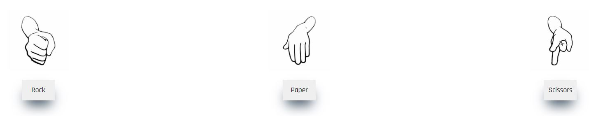

# Rock | Paper | Scissors

Welcome to Rock Paper Scissors

This webpage has been created and designed for users looking for a simple and fun destraction from their day.
The user can play against the computer by choose their option first and playing against the computer.
The game will keep a score of who is winning and on refreshing the screen clear all the available data.

---

## Preparation

- **Wire Frame**
    1. During the planning phase of the project a wireframing tool called balsamiq was used. 
    2. By using a wireframe the webpage could be visualised and the number of sections and functions understood from a high level.
    3. Throughout the project the wireframe was used as a guide of what was set out to achieve.
    4. The wireframe file can be viewed here [Link](./assets/wireframe/Rock_Paper_Scissors.bmpr)

---

## User Stories

---

## Technologies Used

---

## Features

### Existing Features

- **Navigation Menu**
    1. A logo has been added to the top of the page to ensure the visitor knows what they are reviewing.
    2. Underneath the logo display there is the first prompt line for the user, the user is asked to "Take Your Pick".

- **Selection Area**
    1. The next section of the webpage displays the first play area of the rock paper scissors game.
    2. Here it shows three images representing "Rock" "Paper" and "Scissors" so the user knows what their choices in the game are.
    3. Underneath the image for each selection a button with a box shadow style can be seen which names each selection. The buttons are interactive with a hover effect to ensure the user knows the button is clickable.

- **Rules Area**
    1. To ensure the user understands the game the next section has been set up to show each game rule, what beats what and so on.
    2. The rules section starts with a heading followed by a line of rules seperated by "|" . It was decided that the simpliest way to layout the rules was not using a list but a visual representation of the rule set.

- **Results Display Dashboard**
    1. In order to the user to understand who won in each game a results display dashboard has been created.
    2. On the left side the option the user has selected will be displayed.
    3. On the right side the option that was randomly selected by the computer will be displayed.
    4. In the center of both there is scoreboard to display - Who has won, What the user score is & what the computer score is.
    5. On refreshing the page these scores will be set back to default. 

---

## Testing

### Manual Testing

- **Click Through**
    - In order to ensure that the user experience is as expected manual testing was performed on the webpage.
    - This involved clicking on all all playable links to ensure the user function was running correctly.
    - Testing any hover functions for each button.
    - Scrolling through webpage over different media displays for desktop, laptop, tablet and mobile.
    - After retesting and fixing bugs no more issues where found.

- **Bugs**
    - When completing the click through testing it was found that the logic was slightly off for the scoreboard display "Result" when computer choice was equal to user choice it scored the game as a loss for the user and added a point to the computer. 

- **Screen Resolution**
    - In order to create a user-friendly experience for desktop, tablet and mobile the webpage has been tested for screen resolution sizes.
    - This was carried out using Dev Tools and adjusting the screen resolution for each respectively.
    - After retesting the bugs that were found no issues could be noticed, this was also passed via Lighthouse.

- **Bugs**
    - There was a bug found when adjusting the screen resolution to mobile. It was found that there was an inheriated width set causing the items on the screen to not align correctly. When clearing the margin and setting the width to 100% width for mobile this corrected the matter.

---

### Lighthouse Testing

- The code for each page has been validated using Dev Tools - Lighthouse.
- Using lighthouse as resource allowed for quick retesting and changes to each element that was flagged until an appropriate score was obtained.

### Validator Testing

- HTML
    <!-- - No errors were returned when passing through the official W3C validator -->

- CSS
    - One error found no requirement for margin: 0,auto in logo, this was removed and retested.
    - Site now pass through https://jigsaw.w3.org/css-validator

- JavaScript
    - 

---
## Deployment

### Github Pages

The project was deployed on Github pages using the following method ;

1. Log in to GitHub and locate GitHub Repository by clicking on the Repository Tab at the top of the screen.
2. Click the repository Rock_Paper_Scissors.
3. On the next page at the top locate the "Settings" ribbon and click.
4. From the settings page select the link for "Pages" under the heading of "Code and autmation".
5. Now under "Source" change the drop down from "None" to "Main".
6. Github will refresh and provide a live link, this is now the deployed link.

The live link can be found here - https://svankampen.github.io/rock_paper_scissors/

### GitHub Repository Forking

This project can be forked in order to update the project without changing the deployed webpages function.

1. Log into GitHub and locate the repository.
2. At the top of the Repository page there is a notch link for "Fork", click this link. 
3. A copy of the repository will be created in following this process.

### Clone Project Repository 

You can create a clone of the repository by following the below steps ; 

1. Log into GitHub and locate the repository.
2. At the top of the Repository file there is a button called "Code" when clicked it will display a drop down with clone options. 
3. Here you will see a button for copy via HTTPS. Now you have successfully copied the repository.

---

## Credits 

- **Content**
    - For any code issues that came up https://www.w3schools.com/html/html_css.asp was used as a library of potential solutions in HTML, CSS & JS.
    - Font style comes from opensource google fonts https://fonts.google.com/
    - Javascript file referenced throughout for structure from Coding Institute - I Love Maths project repository.
    - Referenced tutorial used and trialed throughout project https://www.youtube.com/watch?v=RwFeg0cEZvQ&t=996s by Ania Kubow.
    - Three mentoring sessions throughout prject for advice on reducing bulky javascript code - Mentor Akshat Garg.

- **Media**
    - Image for the rock paper and scissors from opensource https://pixabay.com/images/search/rock-paper-scissors/

---

## Ideas for the future

1. Given more time the project would have displayed a animation when the user selected an option, something similar to a graphic of two fists pumping three times as they would in the real world, this would provide some anticipation to the game overall.
2. Provide more options within the game for ; Rock Paper Scissors Lizard Spock.
3. When the user selects an option display an image instead of text for the users selection. The same can be done with the computers choice selection. 

